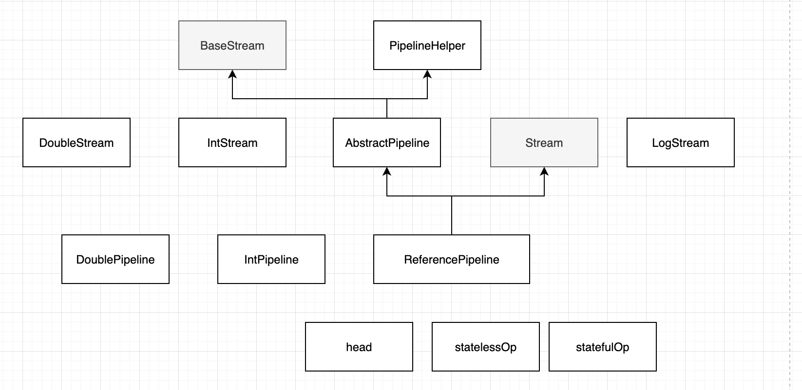
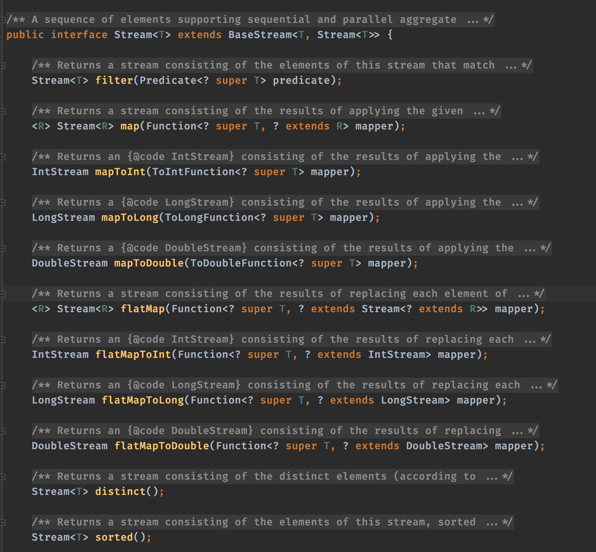

## 前言

Stream是java SE8 API添加的用于增加集合的操作接口，可以让你以一种声明的方式处理集合数据。将要处理的集合看作一种流的创建者，将集合内部的元素转换为流并且在管道中传输，并且可以在管道的节点上处理，比如筛选，排序，聚合等。元素流在管道内经过中间操作（intermediate operation）的处理，最后由终端操作（terminal operation）得到前面处理的结果。

sample example of stream
```
import java.util.stream.Stream;

public class Test {

    public static void main(String[] args) {
        Stream.of(1, 2, 3, 4, 5, 6, 7, 8, 9)
                .map(item -> item * 2)
                .forEach(item -> System.out.print(item + " "));

        System.out.println();

        Stream.of(1, 2, 5, 3, 4, 5, 6, 7, 8, 9)
                .distinct()
                .parallel()
                .map(item -> item * 2)
                .forEach(item -> System.out.print(item + " "));

        System.out.println();

        Stream.of(1, 2, 3, 4, 5, 6, 7, 8, 9)
                .parallel()
                .map(item -> item * 2)
                .forEachOrdered(item -> System.out.print(item + " "));
    }
}
```

result
```
sandbox> exited with status 0
2 4 6 8 10 12 14 16 18 
8 12 16 18 14 10 6 2 4 
2 4 6 8 10 12 14 16 18 
sandbox> exited with status 0
```

## java stream 源码解析

接口和实体类介绍

**思考**
1. 终结操作前均为lazy操作，所有操作并未真正执行
2. 数据是如何传递的
3. 为什么需要有状态操作
    有状态操作是为了解决某些阶段需要全量数据才能处理，所以在类似于sort 阶段需要将上一步的数据都存到 sort 阶段的temp中，
然后在使用sort 逻辑处理所有temp数据， 再保存到 data中。

4. 为什么要引入操作标识位？

5. nextStage.do(nextStage.do, dateElement) ？

一个元素会被每个阶段依次处理，直到遇到状态操作。然后将有状态操作阶段设置为sourceStage。再继续重复，直到终止操作


**Stream 源码操作**

**Stream的创建**
Stream、IntStream、LongStream、DoubleStream接口都提供了静态方法of，用于便捷地创建Stream，分别用于创建引用类型、int、long、double的Stream。以Stream接口为例，传入一系列有序元素，比如Stream.of(1, 2, 3, 4, 5, 6, 7, 8, 9)。如下所示，Stream.of方法通过调用Arrays.stream实现。所以Stream.of(1, 2, 3, 4, 5, 6, 7, 8, 9)等同于Arrays.stream(new int[]{1, 2, 3, 4, 5, 6, 7, 8, 9})

```
//Stream.java
public static<T> Stream<T> of(T... values) {
        return Arrays.stream(values);
    }
//Arrays.java
public static <T> Stream<T> stream(T[] array) {
        return stream(array, 0, array.length);
    }

public static <T> Stream<T> stream(T[] array, int startInclusive, int endExclusive) {
        return StreamSupport.stream(spliterator(array, startInclusive, endExclusive), false);
    }
```

StreamSupport是一个工具类用于创建顺序或并行Stream。StreamSupport.stream需要两个参数： - spliterator，Spliterator类型，可通过Spliterators.spliterator创建，用于遍历/拆分数组， - parallel，boolean类型，标示是否并行，默认为false。

ReferencePipeline实现了stream接口，是实现Stream过程阶段或起始阶段的抽象基类。ReferencePipeline.Head是原始阶段的实现。

```
//StreamSupport.java
public static <T> Stream<T> stream(Spliterator<T> spliterator, boolean parallel) {
        Objects.requireNonNull(spliterator);
        return new ReferencePipeline.Head<>(spliterator,
                                            StreamOpFlag.fromCharacteristics(spliterator),
                                            parallel);
    }
```

至此，Stream创建的简单流程就完成了，IntStream、LongStream、DoubleStream的创建也是类似的。


## 代码阅读



### file：BaseStream.java
```java
public interface BaseStream<T, S extends BaseStream<T, S>>
        extends AutoCloseable {
    
    Iterator<T> iterator();
    Spliterator<T> spliterator();
    boolean isParallel();
    S sequential();
    S parallel();
    S unordered();
    S onClose(Runnable closeHandler);
}
```

### file: Stream.java
该文件定义了接口


### java.util.stream.ReferencePipeline
ReferencePipeline 继承了AbstractPipeline， 实现了Stream 接口
```java
abstract class ReferencePipeline<P_IN, P_OUT>
        extends AbstractPipeline<P_IN, P_OUT, Stream<P_OUT>>
        implements Stream<P_OUT>{}
```

下面一段代码是Map方法的具体实现
```java
    public final <R> Stream<R> map(Function<? super P_OUT, ? extends R> mapper) {
        Objects.requireNonNull(mapper);
        return new StatelessOp<P_OUT, R>(this, StreamShape.REFERENCE,
                                     StreamOpFlag.NOT_SORTED | StreamOpFlag.NOT_DISTINCT) {
            @Override
            Sink<P_OUT> opWrapSink(int flags, Sink<R> sink) {
                return new Sink.ChainedReference<P_OUT, R>(sink) {
                    @Override
                    public void accept(P_OUT u) {
                        downstream.accept(mapper.apply(u));
                    }
                };
            }
        };
    }
```

### file: collector.java
```java

public interface Collector<T, A, R> {

    Supplier<A> supplier();
    BiConsumer<A, T> accumulator();
    BinaryOperator<A> combiner();
    Function<A, R> finisher();
    Set<Characteristics> characteristics();
    public static<T, R> Collector<T, R, R> of(Supplier<R> supplier,
                                              BiConsumer<R, T> accumulator,
                                              BinaryOperator<R> combiner,
                                              Characteristics... characteristics) {
        Objects.requireNonNull(supplier);
        Objects.requireNonNull(accumulator);
        Objects.requireNonNull(combiner);
        Objects.requireNonNull(characteristics);
        Set<Characteristics> cs = (characteristics.length == 0)
                                  ? Collectors.CH_ID
                                  : Collections.unmodifiableSet(EnumSet.of(Collector.Characteristics.IDENTITY_FINISH,
                                                                           characteristics));
        return new Collectors.CollectorImpl<>(supplier, accumulator, combiner, cs);
    }
    public static<T, A, R> Collector<T, A, R> of(Supplier<A> supplier,
                                                 BiConsumer<A, T> accumulator,
                                                 BinaryOperator<A> combiner,
                                                 Function<A, R> finisher,
                                                 Characteristics... characteristics) {
        Objects.requireNonNull(supplier);
        Objects.requireNonNull(accumulator);
        Objects.requireNonNull(combiner);
        Objects.requireNonNull(finisher);
        Objects.requireNonNull(characteristics);
        Set<Characteristics> cs = Collectors.CH_NOID;
        if (characteristics.length > 0) {
            cs = EnumSet.noneOf(Characteristics.class);
            Collections.addAll(cs, characteristics);
            cs = Collections.unmodifiableSet(cs);
        }
        return new Collectors.CollectorImpl<>(supplier, accumulator, combiner, finisher, cs);
    }

    enum Characteristics {
        CONCURRENT,
        UNORDERED,
        IDENTITY_FINISH
    }
}
```


## 源码数据执行步骤
终止操作执行 evaluate 方法
    执行AbstractPipeline抽象类 wrapAndCopyInto
        copyInto
            wrapSink


        //具体实现
        List<String> res = Arrays.stream(strArray)
                .map(w -> w.split(""))
                .flatMap(Arrays::stream)
                .distinct()
                .collect(Collectors.toList());


1. ReferencePipeline.collect 
    -> public final <R, A> R collect(Collector<? super P_OUT, A, R> collector)
       内部调用 container = evaluate(ReduceOps.makeRef(collector));
    -> final <R> R evaluate(TerminalOp<E_OUT, R> terminalOp) 
       内部调用：
        并发：terminalOp.evaluateParallel(this, sourceSpliterator(terminalOp.getOpFlags()))
        非并发：terminalOp.evaluateSequential(this, sourceSpliterator(terminalOp.getOpFlags()));

    -> <P_IN> R evaluateSequential(PipelineHelper<E_IN> helper,
                                Spliterator<P_IN> spliterator);
        
