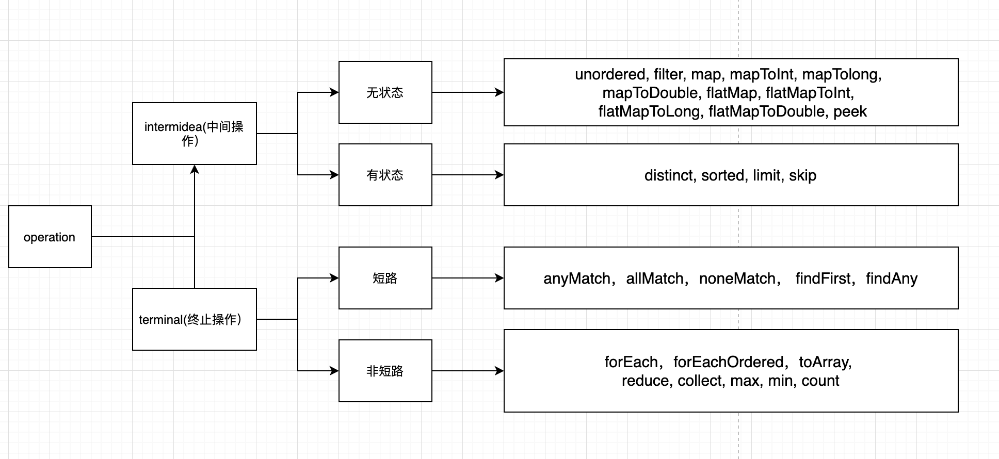
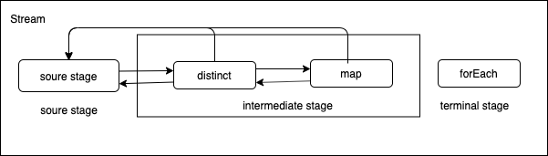

## 前言
golang copy java 轮子(java.util.stream)。
Stream是java SE8 API添加的用于增加集合的操作接口，可以让你以一种声明的方式处理集合数据。将要处理的集合看作一种流的创建者，将集合内部的元素转换为流并且在管道中传输，并且可以在管道的节点上处理，比如筛选，排序，聚合等。元素流在管道内经过中间操作（intermediate operation）的处理，最后由终端操作（terminal operation）得到前面处理的结果。

## wath
stream表示包含着一系列元素的集合，我们可以对其做不同类型的操作，用来对这些元素执行计算。使用流操作，可以使代码更简洁，减少了大量的for循环代码。

## 概念



Stream上的所有操作分为两类：中间操作和终止操作

中间操作只是一种标记，只有终止操作作才会触发实际计算。

中间操作又可以分为无状态的(Stateless)和有状态的(Stateful)，无状态中间操作是指元素的处理不受前面元素的影响状态的中间操作必须等到所有元素处理之后才知道最终结果，比如排序是有状态操作，在读取所有元素之前并不能确定排序结果；

终止操作作又可以分为短路操作和非短路操作，短路操作是指不用处理全部元素就可以返回结果，比如找到第一个满足条件的元素。之所以要进行如此精细的划分，是因为底层对每一种情况的处理方式不同。

## 工作原理
**stream pipeline**

Stream的执行过程被抽象出一个pipeline的概念，每个pipeline会包含不同的阶段（stage） 

- 起始阶段（source stage），有且只有一个，Stream创建的时候即被创建，比如：通过Stream.of接口创建时，会实例化ReferencePipeline.Head作为Stream的起始阶段，

- 过程阶段(intermediate stage)，0个或多个，如下例中包含两个过程阶段：distinct、map，parallel是一个特殊的存在，它只是设置一个标志位， 并不是一个过程阶段。对于过程阶段的各种操作，又有无状态操作(StatelessOp)和有状态操作(StatefulOp)之分, 比如：对于distinct、dropWhile、sorted需要在执行过程种记录执行状态，即有状态操作，而map、filter则属于无状态操作; 

- 终结阶段(terminal stage)，有且仅有一个，用于结果计算或者执行一些副作用，如下例中的forEach

```
Stream.of(1, 2, 5, 3, 4, 5, 6, 7, 8, 9)
                .distinct()
                .parallel()
                .map(item -> item * 2)
                .forEach(item -> System.out.print(item + " "));
```


上例中，最终构造的pipeline如图所示，pipeline数据结构是一个双向链表，每个节点分别存储上一阶段，下一阶段，及起始阶段。终端操作前均为lazy操作，所有操作并未真正执行。而终端操作会综合所有阶段执行计算。


## function
> 中间态 无状态操作

- [x] Map
- [x] Filter
- [ ] FlatMap
- [ ] peek

> 中间态 有状态操作

- [x] Distinct
- [x] Sorted
- [x] Limit
- [x] Skip

> 终止态操作

- [x] Reduce
- [x] ForEach
- [x] ToSlice
- [x] count
- [ ] max
- [ ] min
- [ ] forEachOrdered
- [ ] anyMatch
- [ ] allMatch
- [ ] noneMatch
- [ ] findFirst
- [ ] findAny

## 待改进
- reduce 并发计算，是否有
- distinc 去重计算

## example
```
package main

import (
	"fmt"
	"github.com/xishengcai/stream"
)

func main() {
	type student struct {
		Name string
		Age  int
	}
	stream.New([]student{
		{"a1", 1},
		{"a2", 7},
		{"a3", 0},
		{"a4", 10},
		{"a5", 5},
	}, false).Map(func(v interface{}) interface{} {
		s := v.(student)
		s.Age += 1
		return s
	}).Sorted(func(i, j interface{}) bool {
		s1 := i.(student)
		s2 := j.(student)
		return s1.Age < s2.Age
	}).ForEach(func(v interface{}) {
		fmt.Println(v)
	})

}
```
result
```
{a3 10}
{a1 11}
{a5 15}
{a2 17}
{a4 20}
```

**link**
- [小蓝鲸](https://club.perfma.com/article/116123)
- [吴江法-stream](https://github.com/wujiangfa-xlauncher/stream-for-go)
- [stream 高级用法](https://juejin.cn/post/6844903830254010381#heading-7)


